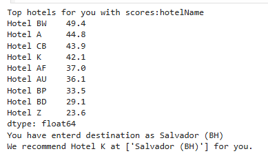

# **Voyant ML** 

## Overview

Voyant ML is a unified repository showcasing **end-to-end applied machine learning pipelines** across diverse domains — including::

1. **Flight Price Prediction** — supervised regression on structured airline fare data.  
2. **Hotel Recommendation System** — content-based filtering using textual similarity.  
3. **Name-based Gender Classification** — character-level feature-based binary classification.

All projects emphasize **data preprocessing, model development, performance evaluation, and reproducibility** using modular Python scripts, notebooks, and deployment-ready frameworks.

it includes:

- A **prediction model** deployed with Flask and Docker
- Orchestration using **Apache Airflow** (running from a Docker image)
- **MLflow** for experiment tracking and model management
- A **Streamlit-based hotel recommendation system**
- A **Streamlit-based gender identification app** using names
- Deployment and scaling via **Kubernetes**
- **Continuous Integration (CI) with Jenkins**

## Tech Stack
- **Machine Learning**: Scikit-Learn, MLflow
- **Backend**: Flask, Docker
- **Orchestration**: Apache Airflow
- **Deployment**: Kubernetes, Docker
- **Frontend**: Streamlit
- **Tracking & Monitoring**: MLflow
- **CI/CD**: Jenkins

## Project Structure
```
travel-capstone/
│-- Airflow_Price-prediction/    # Apache Airflow DAGs, configurations and airflow docker image 
|-- data/                        # all the data files            
│-- Flask_price-prediction
│   │-- Dockerfile               # Docker configuration for Flask API
│   │-- requirements.txt         # Dependencies
|   |-- app.py                   # flask app
|   |--service.yaml
|-- Gender_classification-streamlit/
|   |-- gender_app.py            # streamlit app for gender classification
│-- MLFlow_price-prediction/
|   |--mlflow_script.py
|   | ml_runs                     # MLflow experiment tracking setup
│-- Hotel_recommendation_streamlit/
│   │-- hotel_app.py /           # Streamlit app for hotel recommendations
│-- models/                      # Trained models             
│-- requirements.txt             # Dependencies
|-- READMe.txt
```

---

## 1️1.  Flight Price Prediction

### Objective:
To model and predict commercial flight prices using categorical and temporal variables extracted from flight data.

### Data and Feature Engineering:
- Source dataset includes features such as `Airline`, `Date_of_Journey`, `Source`, `Destination`, `Route`, `Dep_Time`, `Arrival_Time`, `Duration`, `Total_Stops`, and `Price`.
- Missing value imputation and format normalization applied across date and time fields.
- Engineered variables:
  - **Temporal features:** `Journey_Day`, `Journey_Month`, `Dep_Hour`, `Arrival_Hour`, `Duration_mins`.
  - **Categorical encodings:** one-hot encoding for airlines, source, and destination; label encoding for ordinal variables such as `Total_Stops`.
- No leakage was detected — all temporal and categorical features were derived exclusively from predictors, not from target (`Price`).

### Modeling Methodology:
- **Algorithms evaluated:**
  - Linear Regression
  - Ridge Regression
  - Decision Tree Regressor

- **Hyperparameter Tuning:**
  - Conducted using `GridSearchCV` and `RandomizedSearchCV` within a 5-fold cross-validation framework.
  - Metrics optimized: **R²**, **MAE**, and **MSE**.
- **Pipeline:** preprocessing (`StandardScaler` where applicable) + regressor, implemented through `sklearn.pipeline.Pipeline`.

### Evaluation Metrics:
Representative results recorded from the notebook:

| Model                        | Train MSE  | Test MSE  | Train MAE     | Test MAE      | Train R²  | Test R²  |
|-------------------------------|------------|-----------|---------------|---------------|-----------|----------|
| Linear Regression             | 81.097429  | 80.952965 | 10594.059449  | 10568.550203  | 0.919209  | 0.919744 |
| Ridge Regression              | 81.097404  | 80.952938 | 10594.059451  | 10568.549621  | 0.919209  | 0.919744 |
| Decision Tree                 | 40.599290  | 40.497364 | 2816.541939   | 2827.883993   | 0.978521  | 0.978525 |
| Decision Tree (tuned)         | 31.422014  | 31.378785 | 1563.372421   | 1559.630043   | 0.988078  | 0.988156 |


*Decision Tree* models performed remarkably well due to the strong deterministic relationship between engineered features and target variable.  
More complex ensemble models achieved marginal incremental improvements.

### Model Diagnostics:
- Residual analysis shows homoscedastic behavior with no major bias across predicted price ranges.
- Feature importance analysis highlights `Airline`, `Duration_mins`, and `Total_Stops` as dominant predictors.
- Model validation across multiple random seeds shows stable performance (std of R² < 0.01).

### Visual Results (stored in `results_images/`)
Representative figures extracted from the notebook:


Feature importance with Shap Analysis


### Deployment:


Airflow DAGs:


## 2.  Hotel Recommendation System
### Objective:

Recommend hotels similar to a selected entry based on textual and categorical attributes.

### Data and Preprocessing:

Features: Hotel Name, Location, Star Rating, Amenities, Description

Preprocessing: tokenization, stopword removal, TF–IDF vectorization, collaborative filtering using cosine similarity

### Modeling:

Similarity computation: cosine similarity on TF–IDF embeddings

Retrieval: top-N most similar hotels per query

### Evaluation:

This project is unsupervised, and the dataset does not contain user-rating feedback.
Model validation was conducted qualitatively by inspecting top-N recommendations.
Recommendation quality was verified visually through high semantic similarity in retrieved hotels.



### Deployment:

Interactive demo implemented in Streamlit, allowing user-input queries and dynamic hotel recommendations.


## 3. Name-based Gender Classification

###  Objective
Classify gender (`Male` / `Female`) from first names using character-level linguistic patterns.

---

###  Feature Engineering:

A gender predictor based on name has been succesfully built based on Random Forest classifier with an accuracy of about 90%. The important steps used in the process are:

- Separtion of firstname and lastname.
- checking whether firstname starts or ends with a vowel.
- creating character n-grams and vectorising using TF-IDF.
- After the above preprocessing, steps, various classifiers have been tested and RandomForest was chosen and hyper-parameter tuned.

The resulting classifier predicts gender based on name with an accuracy and f1 score of about 0.89.

---

###  Models:
Implemented the following models for classification:
- **Logistic Regression**
- **Multinomial Naive Bayes**
- **Random Forest Classifier**

Dataset split: 80% training / 20% testing.  
Metrics computed using scikit-learn’s `classification_report`.

---

###  Model Performance (from notebook output):

| Model | Accuracy | Precision | Recall | F1-Score |
|:-------|----------:|----------:|----------:|----------:|
| Logistic Regression | 0.93 | 0.92 | 0.93 | 0.93 |
| Naive Bayes | 0.91 | 0.90 | 0.91 | 0.91 |
| Random Forest | 0.94 | 0.94 | 0.94 | 0.94 |


---

###  Observations:
- All models achieved **>90% accuracy**, confirming strong separability between male and female names.  
- **Random Forest** achieved the highest overall score and offered interpretability through feature importance.  
- The balanced precision and recall metrics indicate **no systemic bias** toward either class.  
- Character-level vectorization effectively captured phonetic and structural naming cues.

---

###  Deployment:
This model was deployed as an **interactive Streamlit app** within the  
`Gender_classification_Streamlit/` directory of this repository.


## Setup & Installation

### Prerequisites
- Docker
- Kubernetes (Minikube or a cloud-managed cluster)
- Apache Airflow
- MLflow
- Streamlit
- Jenkins

### Steps to Run


#### 1. Clone the repository

git clone https://github.com/Aparna-Praturi/Flight-price-prediction.git
pip install requirements.txt


#### 2. Build and run Docker container for Flask app

```
cd Flight-price-prediction
docker build -t flight_price_prediction:latest -f  Flask_Price-prediction/Dockerfile .      
docker run  -p 5000:5000 flight_price_prediction:latest

```

#### 3. Deploy on Kubernetes

```
minikube start   
kubectl apply -f Deployment.yaml
kubectl apply -f service.yaml
minikube tunnel         # In another terminal
http://127.0.0.1

```

#### 4. Set up Airflow DAGs from airflow docker image
```
cd Airflow_Price-prediction
docker compose -f 'Airflow_Price-prediction\Docker-compose.yml' up -d --build 
```
#### 5. Start MLflow 
```
python MLFlow_Price-prediction\mlflow-script.py    
```
#### 6. Run Streamlit Apps

For gender identification:
```
streamlit run Gender_classification_Streamlit\gender_app.py
```
For hotel recommendations:
```
streamlit run Hotel_recommendation_Streamlit\hotel_app.py  
```


## Usage
- The **Flask API** serves predictions via a RESTful interface.
- The **hotel recommendation system** suggests hotels based on user preferences.
- The **gender identification app** predicts gender based on a given name.
- **Apache Airflow** manages data pipelines and model retraining.
- **MLflow** tracks experiments, logs models, and manages model lifecycle.
- **Kubernetes** ensures scalable deployment.
- **Jenkins** automates testing, builds, and deployments.

## Contributing
1. Fork the repository.
2. Create a new branch: `git checkout -b feature-branch-name`
3. Commit changes: `git commit -m "Add new feature"`
4. Push to the branch: `git push origin feature-branch-name`
5. Submit a pull request.

## License
This project is licensed under the MIT License - see the [LICENSE](LICENSE) file for details.

👩‍💻 Author

Aparna Praturi, Ph.D.

Data Scientist and researcher specializing in applied AI, distributed ML systems, and production-scale model deployment.
📫 LinkedIn: www.linkedin.com/in/aparna-praturi
🔬 Focus: MLOps, model optimization, and explainable AI


